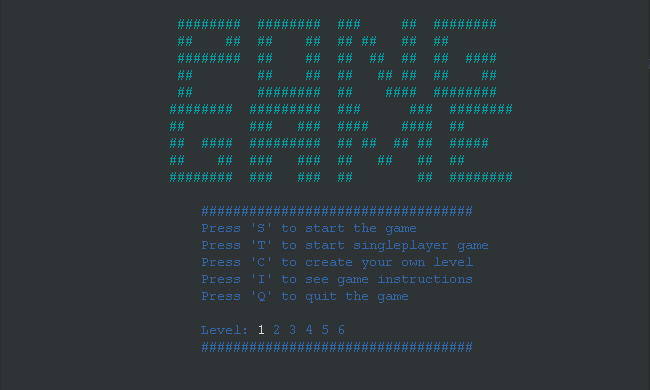
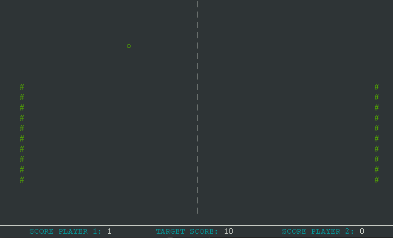

## LDTS_T10G04  - Pong Game

## Game Description

Neste trabalho pretende-se desenvolver o clássico jogo "Pong". O jogo consiste em dois paddle que se movimentam para cima ou para baixo, controlados por dois jogadores ou por um jogador e o computador, e uma bola que se movimenta livremente pelo campo de jogo e ao embater num objeto, muda a sua direção para uma direção no sentido oposto.

Este projeto foi desenvolvido por *Rafael Azevedo Alves* (up202004476@fc.up.pt), *Pedro João Gonçalves Novo Paixão* (up202008467@fe.up.pt) e *João Victor Botelho Duarte* (up202102361@up.pt) para LDTS 2022/2023.

## Gif

## Screenshots

The following screenshots ilustrate the general look of our game, as well as the divergent functionalities:

### Menus

  

  <b><i>Fig 1. Main Menu </i></b>

  

 
 

  

  <b><i>Fig 2. Instructions Menu </i></b>  

  

 
 

  

  <b><i>Fig 3. Create Level Menu </i></b>

  

 
 

  

  <b><i>Fig 4. Game Win Menu </i></b>

 
 

### Gameplay

  

  <b><i>Fig 5. SinglePlayer and Multiplayer Gameplay </i></b>

 
 

  

  <b><i>Fig 6. Create Level Gameplay </i></b>

 
 

  

  <b><i>Fig 7. Bounce when ball hits a wall </i></b>

  

  <b><i>Fig 8. Goal Scored </i></b>

 
 
